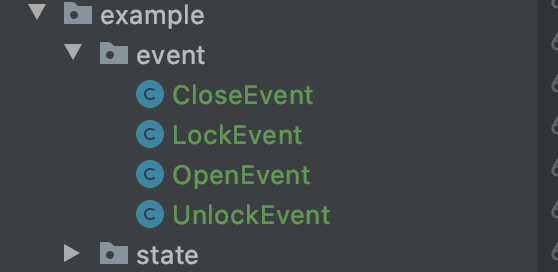
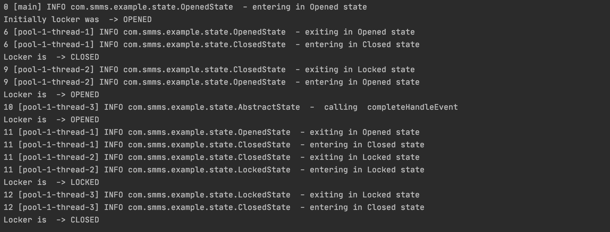

# State Machine Management System  (SMMS)

SMMS provides state management in simple and effective way, has capability of
handling events synchronously and asynchronously both.


[](https://github.com/Priytam/statemachine/blob/master/LICENSE)
[](https://travis-ci.org/Priytam/statemachine)
[](https://search.maven.org/search?q=g:com.github.priytam%20AND%20a:statemachine)

[](http://hits.dwyl.io/Priytam/statemachine)
[](https://github.com/ellerbrock/open-source-badges/)
[](https://GitHub.com/Naereen/StrapDown.js/graphs/commit-activity)

## Purpose
*To write a state machine system in easy and effective way*

If your system requires managing complex states like below consider this tool as your life saver
<div>
    
    
    
</div>


## Table of Contents

  1. [Creating state machine](#creating-state-machine)
  1. [Posting an event](#posting-event)
  1. [Initial state](#initializebegin-state)
  1. [Creating states](#creating-states)
  1. [Persisting state](#persisting-state)
  1. [Example1](#example1)

# Note : Below doc is not yet complete 

## Creating state machine
**There are two types of state machine**
1. SyncStateMachine (Sync processing of an event to it)
2. StateMachine (Async processing of an event to it)

*Creating async state machine*
```text
     new StateMachine(new ContextObject(), 10, 3);
```
*arguments are*
1. A context that will be passed on each life cycle of a state
1. Max number of pending events 
1. Thread pool

*Creating sync state machine*
```text
     new SyncStateMachine(new ContextObject());
```
*arguments are*
1. A context that will be passed on each life cycle of a state

**[Back to top](#table-of-contents)**

## Posting event
An event can be posted to stateMachine, postEvent on stateMachine calls current state's onEvent method.
On async StateMachine's postEvent call return immediately and perform state's onEvent method on a separate 
thread but on sync StateMachine it returns when state's onEvent completes, there is also postEventAndWait(event, waitTimeInMillis) 
method on async stateMachine that waits for the given time and throws exception if time expires.

```text
   stateMachine.postEvent(event);
   stateMachine.postEventAndWait(event, timeInMillis);
```
an event is a subClass of Object class and will be passed as argument on state's onEvent method

**[Back to top](#table-of-contents)**

## Initialize(begin) state
*Initialize state machine (beginning state)*
```text
     stateMachine.initState(new BeginState());
```
where BeginState is subClass of State class

**[Back to top](#table-of-contents)**

## Creating states
*To create a state extends State class, it primarily asks to implement onEntry, onEvent and onExit*

***onEntry***
```text
public void onEntry(Object context, State fromState) throws StateException
```
- gets called at entry of any state
- context is the object passed while creating stateMachine
- fromState the state from which system is transiting and will be null if it is beginning state 

***onExit***

```text
    public void onExit(Object context, State toState) throws StateException
```
- gets called at exist of any state
- context is the object passed while creating stateMachine
- toState is the state to which system is transiting and will be null if it is beginning state 

***onEvent***   
```text
protected State onEvent(Object context, Object theEvent) throws StateException {
```
- gets called every time postEvent is called on stateMachine
- context is the object passed while creating stateMachine
- theEvent is the event which is posted on the state machine
- if a new State is returned from this method and system will transit to that state
- if null or same State is returned system will stay in same state

*other functionalities can be overridden*
1. void doConstantly(Object context) 
1. Object onRequest(Object context, Object theRequest)
1. State completeHandleEvent(Object context, Object theEvent)

**[Back to top](#table-of-contents)**

## Persisting State
*todo: cover detailed explanation**
- save state's number to db
_ restore from momento

**[Back to top](#table-of-contents)**

## Example1
Let's write a system which manage states as below diagram


**States**
*In above diagram system has 3 states (Opened, Closed and Locked)*

*Opened State implementation*

if CloseEvent is posted on this state then state will be changed to Closed**
```java
public class OpenedState extends AbstractState {
    private static final Logger log = Logger.getLogger(OpenedState.class);

    public OpenedState(int iType) {
        super(iType);
    }

    @Override
    public void onEntry(Object context, State fromState) throws StateException {
        log.info("entering in Opened state");
    }

    @Override
    protected State onEvent(Object context, Object theEvent) throws StateException {
        if (theEvent instanceof CloseEvent) {
            return StateFactory.getInstance().getState(DoorStates.CLOSED);
        }
        return null;
    }

    @Override
    public void onExit(Object context, State toState) throws StateException {
        log.info("exiting in Opened state");
    }
}
```

*Closed State implementation* 

if theEvent is of type LockEvent change state to Locked similarly for OpenEvent.** 
```java
public class ClosedState extends AbstractState {
    private static final Logger log = Logger.getLogger(ClosedState.class);

    public ClosedState(int iType) {
        super(iType);
    }

    @Override
    public void onEntry(Object context, State fromState) throws StateException {
        log.info("entering in Closed state");
    }

    @Override
    protected State onEvent(Object context, Object theEvent) throws StateException {
        if (theEvent instanceof LockEvent) {
            return StateFactory.getInstance().getState(DoorStates.LOCKED);
        }
        if (theEvent instanceof OpenEvent) {
            return StateFactory.getInstance().getState(DoorStates.OPENED);
        }
        return null;
    }

    @Override
    public void onExit(Object context, State toState) throws StateException {
        log.info("exiting in Locked state");
    }
}

```

*Locked State implementation*

if theEvent is of type UnlockEvent change state to Closed**
```java
public class LockedState extends AbstractState {
    private static final Logger log = Logger.getLogger(LockedState.class);

    public LockedState(int iType) {
        super(iType);
    }

    @Override
    public void onEntry(Object context, State fromState) throws StateException {
        log.info("entering in Locked state");

    }

    @Override
    protected State onEvent(Object context, Object theEvent) throws StateException {
        if (theEvent instanceof UnlockEvent) {
            return StateFactory.getInstance().getState(DoorStates.CLOSED);
        }
        return null;
    }

    @Override
    public void onExit(Object context, State toState) throws StateException {
        log.info("exiting in Locked state");
    }
}
```

**Events**
*There are four events can be performed on system (Open, Close, Lock and Unlock)*
Create an empty class per events for identifying event like below


**State Handler** 
*Post an event to change the state*
 ```java
 public class StateHandler {
     public static final int MAX_EVENTS = 40;
     public static final int THREAD_POOL_SIZE = 3;
     private StateMachine stateMachine;
 
     public boolean init() {
         stateMachine = new StateMachine(new DummyLocker(), MAX_EVENTS, THREAD_POOL_SIZE);
         stateMachine.initState(StateFactory.getInstance().getState(DoorStates.OPENED));
         return true;
     }
 
     public boolean open() {
         //return stateMachine.postEvent(new OpenEvent());
         try {
             return stateMachine.postEventAndWait(new OpenEvent(), 2000);
         } catch (Throwable e) {
             System.out.println(e.getMessage());
         }
         return false;
     }
 
     public boolean close() {
         //return stateMachine.postEvent(new CloseEvent());
         try {
             return stateMachine.postEventAndWait(new CloseEvent(), 2000);
         } catch (Throwable e) {
             System.out.println(e.getMessage());
         }
         return false;
     }
 
     public boolean lock() {
         //return stateMachine.postEvent(new LockEvent());
         try {
             return stateMachine.postEventAndWait(new LockEvent(), 2000);
         } catch (Throwable e) {
             System.out.println(e.getMessage());
         }
         return false;
     }
 
     public boolean unlock() {
         //return stateMachine.postEvent(new UnlockEvent());
         try {
             return stateMachine.postEventAndWait(new UnlockEvent(), 2000);
         } catch (Throwable e) {
             System.out.println(e.getMessage());
         }
         return false;
     }
 
     public String getState() {
         return DoorStates.getState(stateMachine.getState().getStateType());
     }
 
     public void shutDown() {
         stateMachine.shutDown();
     }
 
     public static class DummyLocker {
 
     }
 }
```

**example of stateHandler**

```java
public class DoorStateTest {

    static {
        BasicConfigurator.configure();
        Logger.getRootLogger().setLevel(Level.INFO);
    }
    public static void main(String[] args) {

        // begin
        StateHandler stateHandler = new StateHandler();
        stateHandler.init();
        System.out.println("Initially locker was  -> " +  stateHandler.getState());

        // try closing locker
        stateHandler.close();
        System.out.println("Locker is  -> " +  stateHandler.getState());


        // try opening again
        stateHandler.open();
        System.out.println("Locker is  -> " +  stateHandler.getState());

        // try locking on open nothing will happen
        stateHandler.lock();
        System.out.println("Locker is  -> " +  stateHandler.getState());


        // try close and lock
        stateHandler.close();
        stateHandler.lock();
        System.out.println("Locker is  -> " +  stateHandler.getState());

        stateHandler.unlock();
        System.out.println("Locker is  -> " +  stateHandler.getState());
        stateHandler.shutDown();
    }
}
```

**Output is**


