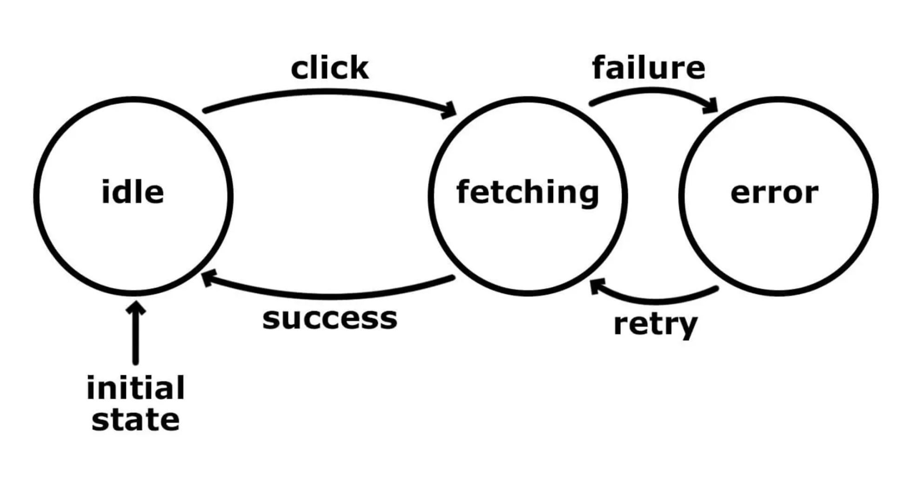
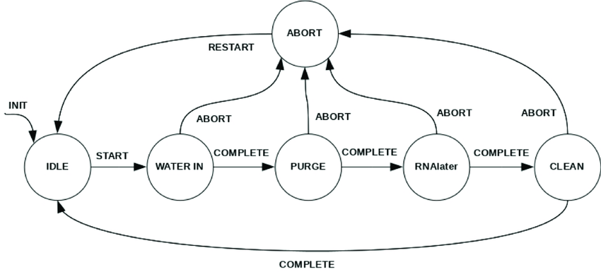
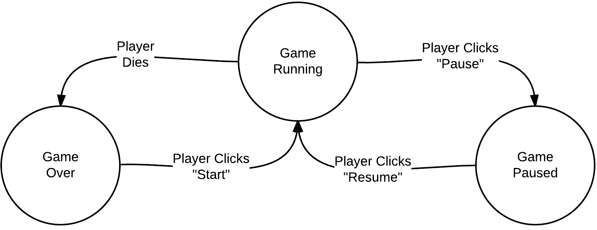

# State Machine Management System  (SMMS)

SMMS provides state management in simple and effective way, has capability of
handling events synchronously and asynchronously both.

## Purpose
*To write a state machine system in easy and effective way*

If your system requires managing states like below consider this
tool as your life saver

    
    
    

## Table of Contents

  1. [Design](#design)
  1. [Getting started](#getting-started)
  1. [Life Cycle](#life-cycle)
  1. [Creating state machine](#creating-state-machine)
  1. [Creating states](#creating-states)
  1. [Posting an event](#posting-event)
  1. [Persisting state](#persisting-state)
  1. [Example1](#example1)
  1. [Example2](#example2)
  1. [Example3](#example3)

## Design
**[Back to top](#table-of-contents)**

## Getting Started
**[Back to top](#table-of-contents)**

## Life Cycle
**[Back to top](#table-of-contents)**

## Creating state machine
**[Back to top](#table-of-contents)**

## Creating states
**[Back to top](#table-of-contents)**

## Posting event
**[Back to top](#table-of-contents)**

## Persisting State
**[Back to top](#table-of-contents)**

## Example1
Let's write a system which manage states as below diagram

**[Back to top](#table-of-contents)**

## Example2
Let's write a system which manage states as below diagram

**[Back to top](#table-of-contents)**

## Example3
Let's write a system which manage states as below diagram

**[Back to top](#table-of-contents)**
